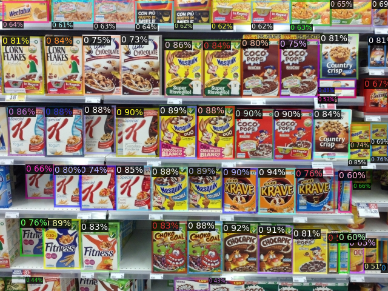
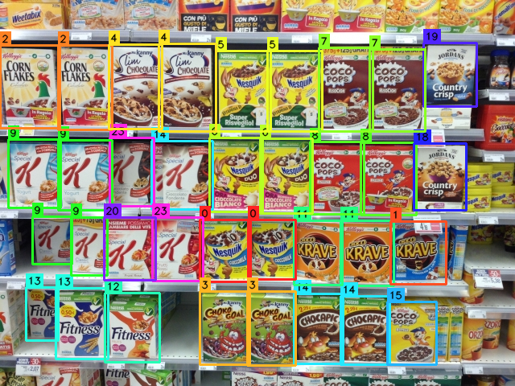
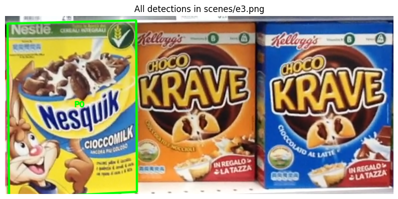
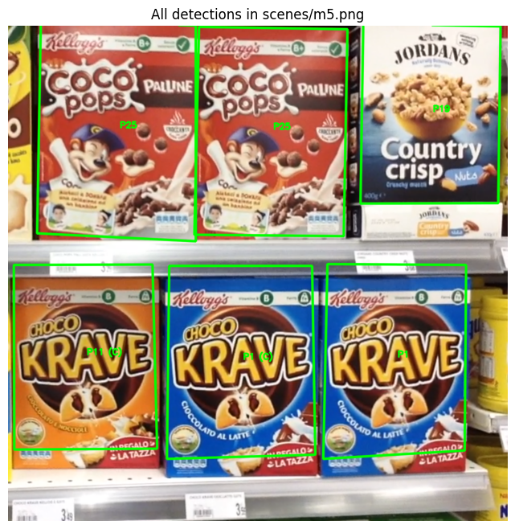
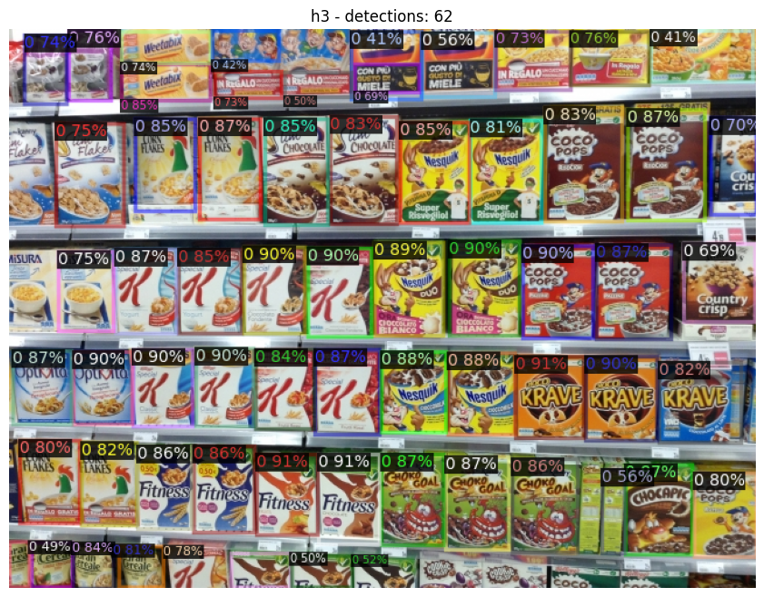
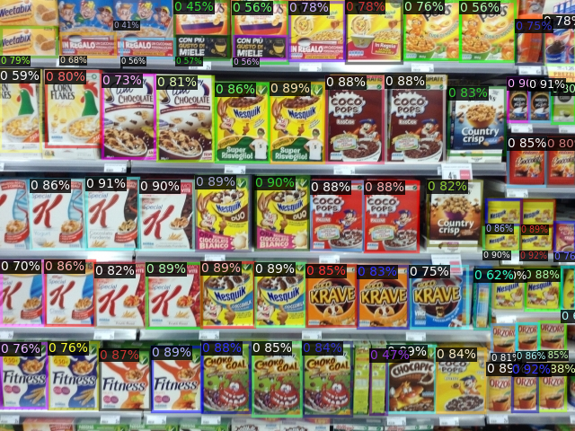
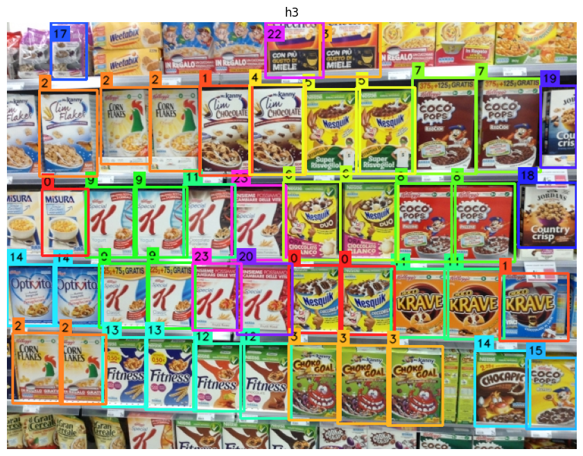
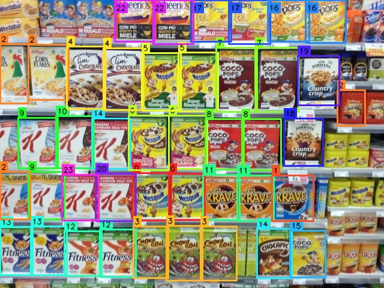

# Product Recognition on Store Shelves

> Detecting and recognising cereal-box products on cluttered supermarket shelves — from a single instance per product, to multiple instances, up to a full 27-class catalogue.

**Computer Vision project** · keypoint matching · Generalized Hough voting · deep object detection · vision-language classification

<p align="center">
  
  
</p>

<p align="center"><sub>Final pipeline on the full dataset: dense object detection (left, 62 boxes) followed by per-box classification into 27 classes (right).</sub></p>

---

## Table of contents

- [Overview](#overview)
- [Tech stack](#tech-stack)
- [Repository structure](#repository-structure)
- [Task A — Single instance detection](#task-a--single-instance-detection)
- [Task B — Multiple instances](#task-b--multiple-instances)
- [Task C — Full dataset detection & classification](#task-c--full-dataset-detection--classification)
- [Training & data augmentation](#training--data-augmentation)
- [A note on the code](#a-note-on-the-code)
- [Author](#author)

---

## Overview

The goal is to locate and identify packaged products (cereal boxes) on store-shelf
photographs. The project is split into three tasks of increasing difficulty, each one
introducing a different family of computer-vision techniques:

| Task | Scenario | Core approach |
|------|----------|---------------|
| **A** | One instance of each product per shelf | SIFT keypoint matching + RANSAC homography |
| **B** | Multiple instances of the same product | Generalized Hough Transform (4D voting) + IoU post-processing |
| **C** | Full 27-class catalogue, dense shelves | Deep object detection (Detectron2) + CLIP & EfficientNet-B0 classification |

Each task is implemented end-to-end, with custom post-processing to turn raw matches
into clean, labelled bounding boxes.

## Tech stack

`Python` · `OpenCV` (SIFT, FLANN, RANSAC) · `NumPy` · `PyTorch` · `Detectron2`
(RetinaNet + ResNet-50-FPN) · `CLIP` via `transformers` · `EfficientNet-B0` via
`torchvision` · `Matplotlib`

## Repository structure

```
product-recognition-on-store-shelves/
├── assets/                          # result images shown in this README
└── src/                             # selected snippets + function signatures
    ├── task_a_single_instance.py
    ├── task_b_multi_instance.py
    ├── task_c_object_detection.py
    └── task_c_classification.py
```

---

## Task A — Single instance detection

Since each product appears at most once per shelf, a standard keypoint-matching
strategy is enough. For every reference (product) image I extract **SIFT** keypoints and
descriptors, do the same for each shelf image, match descriptors with a **FLANN** matcher
filtered by **Lowe's ratio test**, and finally estimate a **homography via RANSAC** to draw
the bounding box on the shelf.

```python
# SIFT + FLANN setup
sift  = cv2.SIFT_create()
index_params  = dict(algorithm=FLANN_INDEX_KDTREE, trees=12)
search_params = dict(checks=500)
flann = cv2.FlannBasedMatcher(index_params, search_params)
```

**The tricky case — colour-only variants.** Because SIFT works on greyscale, it struggles
with brands whose variants differ mainly by *colour* (e.g. the blue vs. orange "Choco Krave").
To disambiguate, I crop the detected box, convert to **HSV**, and compare how many pixels
fall inside the blue vs. orange ranges:

```python
def classify_krave_variant_by_color(img_bgr, box):
    """Decide whether the detected box is the blue ('1') or orange ('11')
    Choco Krave variant, from the dominant colour inside the box. → str | None"""
    ...   # implementation withheld (see "A note on the code")
```

The main loop iterates over the shelves and, for each product, runs matching → Lowe ratio →
RANSAC → box projection, treating every detection as a dictionary of metadata. Overlapping
boxes from different classes on the same product are avoided with a high match threshold.

<p align="center">
  
</p>
<p align="center"><sub>Single-instance detection on a reduced scene.</sub></p>

---

## Task B — Multiple instances

The same matching idea is extended with a **voting mechanism** (a Generalized Hough
Transform) plus post-processing, so that *several copies of the same product* can be found and
cleanly separated.

**1) Features & barycenters.** For each product image I extract keypoints, compute the
barycenter, and store the vector joining every keypoint to that barycenter.

**2) Matching & 4D voting.** Each surviving keypoint casts a vote into a 4D accumulator —
estimated **barycenter position (x, y)**, **scale**, and **rotation angle** — so multiple
instances produce multiple peaks.

```python
def vote_in_4d_accumulator(good_matches, kp_query, kp_scene, joining_vectors,
                           scene_shape, xy_bin=20, scale_bin=0.2,
                           angle_bin=20, scale_min=0.5, scale_max=2.0): ...
def build_4d_accumulator(scene_shape, scale_min, scale_max,
                         angle_bin, scale_bin, xy_bin): ...
```

**3) Peak extraction (4D NMS).** The accumulator is split into blocks; per block I keep the
strongest bin above a threshold. Since a peak behaves like a small Gaussian rather than a single
spike, I also gather the votes in its neighbourhood:

```python
def nms_4d(accumulator, vote_threshold=5, radius_xy=1, radius_s=1, radius_t=1): ...
def get_peak_matches_neighborhood(votes_info, peak_bin,
                                  radius_xy=1, radius_s=1, radius_t=1): ...
```

**4) Detection & post-processing.** Each peak's matches are turned into a box via RANSAC
homography. Two clean-up passes follow:

- *Same-class duplicates* — boxes whose centers are close are grouped and merged into a single,
  more precise box (`group_close_detections`, `merge_group_matches`).
- *Different-class overlaps* — only one class may survive per product, so overlaps are resolved
  **pairwise by Intersection-over-Union**, keeping the box with more RANSAC inliers
  (`compute_iou`, `suppress_overlapping_detections_global`).

<p align="center">
  
</p>
<p align="center"><sub>Multiple instances per product, with duplicate and cross-class overlaps resolved.</sub></p>

---

## Task C — Full dataset detection & classification

On the full, densely packed dataset, pure keypoint matching is no longer robust enough.
I split the problem into two stages: **find the boxes first, classify them second.**

### Stage 1 — Object detection (Detectron2)

A single-class detector finds *as many cereal boxes as possible*. The model uses a
**ResNet-50 + FPN** backbone with a **RetinaNet** head (COCO-pretrained), fine-tuned on the
**SKU-110k** dataset of cluttered shelves to detect one generic "product" class.

<p align="center">
  
  
</p>
<p align="center"><sub>62 product boxes detected on a dense shelf.</sub></p>

### Stage 2 — Classification (CLIP + EfficientNet-B0)

Each detected crop is then labelled by two networks that progressively narrow the decision:

- **CLIP** (zero-shot, vision-language) compares each crop against the brand names and selects
  the **two most likely brands**.
- **EfficientNet-B0** (last layer adapted to 27 classes, trained on an augmented dataset)
  scores all 27 classes.

The two signals are fused with a **masked softmax**: classes outside CLIP's top-2 brands are
suppressed, and the remaining scores are re-normalised — forcing the final prediction to stay
consistent with the brand CLIP is confident about.

```python
def clip_top2_brands(clip_model, clip_processor, crop_rgb, brand_names, device): ...
def mask_logits_to_allowed(logits_1d, allowed_idx): ...
```

> **Why fuse them?** Alone, EfficientNet-B0 often produces flat scores across 27 visually
> similar classes (small synthetic dataset, small network). CLIP restricts the decision space
> and stabilises the result. The trade-off: masking narrows ambiguity rather than removing it —
> genuine uncertainty is preserved and propagated.


<p align="center">
  
  
</p>
<p align="center"><sub>Final per-box class assignment over the full 27-class catalogue.</sub></p>

---

## Training & data augmentation

To train EfficientNet-B0 with only one reference image per class, I generate **15 synthetic
variants per class**, randomly combining:

- a strong **Gaussian blur**,
- **perspective warps** from the four directions (vertices displaced, homography applied), to
  mimic viewing angles,
- a **glare effect** modelled as a radial-intensity ellipse.

The model is then trained with a **weighted cross-entropy loss**, so errors on the harder,
visually similar classes weigh more heavily on the objective.

```python
def generate_15_variants(img, rng): ...
def build_class_weights(num_classes, hard_classes, hard_weight, device): ...
```

---

## A note on the code

This is a **showcase** repository: the files under `src/` contain the **architecture** —
the high-level pipelines and the **signatures and docstrings** of the key functions — while the
heavier implementations are intentionally omitted. This keeps the public repo focused on the
*design and reasoning* behind the project. The full source is available on request.

---

## Author

**Thomas Broccoli** — university Computer Vision project.

GitHub: [@broccolithomas01](https://github.com/broccolithomas01)

If you'd like to discuss the implementation details, feel free to reach out.
